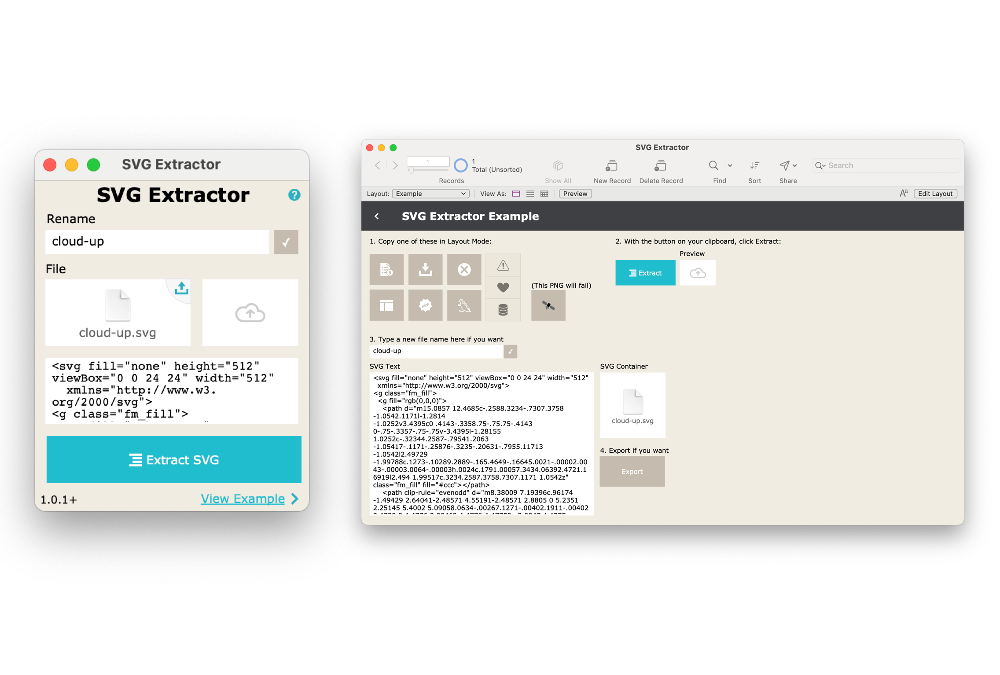

# FileMaker SVG Extractor

Extract SVG files from FileMaker Pro button and button bar objects. Simply copy the button or button bar segment in layout mode, and then click "Extract SVG" in this file. Then you can give it a custom filename and export the svg to your computer.

